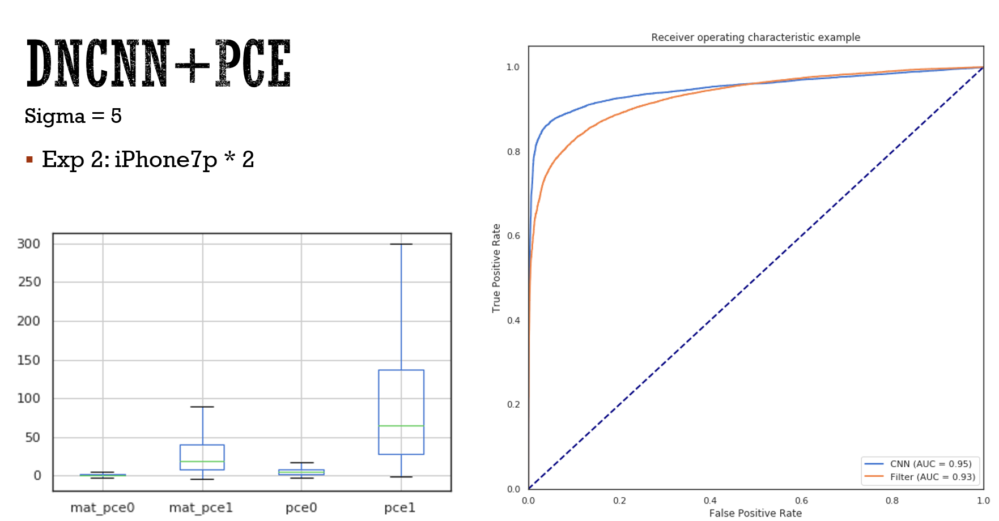

# CameraFingerprint (pytorch)

Extract camera fingerprint based on ffdnet.

Multiple GPU support for large images added.

 Also support comparison with original matlab method.

Tested on `iPhone_7p` `iPhone_5s` `Samsung_S8`. If interested in the dataset and extracted pattern, welcome to contact.

